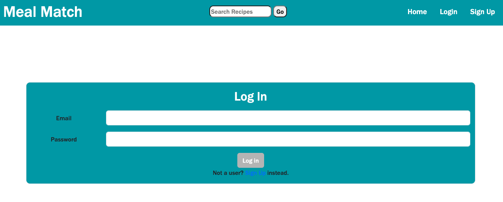

# HWP_Meal-Planner

---

## Table of Contents

---

- [Description](#description)
- [Usage](#usage)
- [Installation](#installation)
- [Contributing](#contributing)
- [Questions](#questions)
- [License](#license)

## Description

---

A full stack application using the RESTful API method. It uses the Edemam api to generate recipes which the user can save in their own personal "recipe box" and recall later. The saved recipes are stored in a database with the users and connected by user_id. Each recipe can show a list of ingredients and has a link to the original website for complete instructions

## Usage

---

When you load the landing page you are greeted with a randomly generated recipe that you can save to your recipe box.

there is a navbar at the top with login/signup options. When you `login`

or `sign up`

the navbar display changes to logout and has a link to the users recipe box. There is a searchbar in the header to search for recipes. When you click search,

a list of recipes pops up which you can choose to view the recipe url or save the recipe to your recipe box. If you save the recipe you will be directed to your recipe box with your new recipe added.

And finally, if you click on the details page you can view a list of the ingredients and view the link for your desired recipe for the night.

## Installation

---

Get a free api key at [Edemam](https://developer.edamam.com/edamam-recipe-api) and clone the repository to your local machine. Create your own .env file to store the api key and database information. Run `npm i` to install dependencies and use mysql to run the schema.sql to create the database - From there you can run `npm run seed` to seed the database and `npm start` to start the server.

## Credits

---

- Phillip Pfister [github](https://github.com/Phil-Pfister)
- Adam Hood [github](https://github.com/adamhood15)
- Philipp Winston [github](https://github.com/PhilippWinston)

## Tests

---

## Links

---

GitHub [link](https://github.com/Phil-Pfister/HWP_Meal-Planner)

Heroku [link](https://young-gorge-82099.herokuapp.com/)

## License

---

This application uses the The Unlicense license
